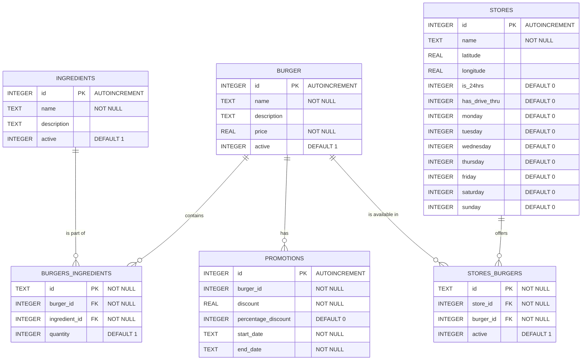
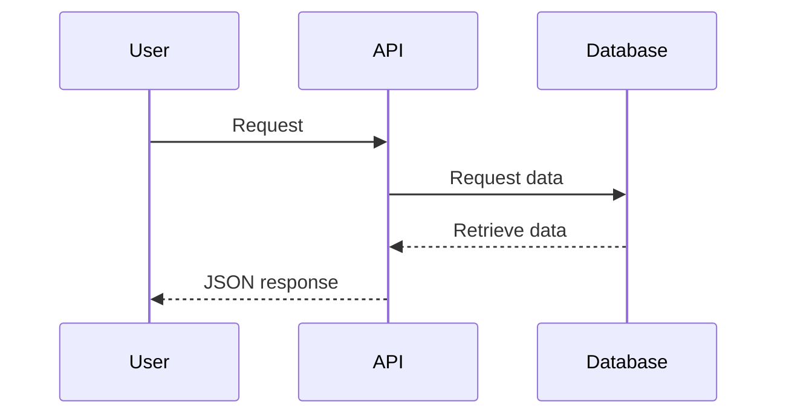

# Negocio de Hamburguesas API - README

Este sistema es una aplicación web desarrollada con FastAPI que gestiona un negocio de hamburguesas. Está diseñada para facilitar la administración y realizar operaciones CRUD sobre entidades del negocio. Además, el sistema incluye funcionalidades de autenticación y autorización para asegurar que solo los usuarios autorizados puedan acceder a los recursos protegidos.

### Funcionalidades Clave
- Autenticación y Autorización:
Permite a los usuarios autenticarse y obtener un token de acceso para acceder a los recursos protegidos.
- Operaciones CRUD: Proporciona endpoints para crear, leer, actualizar y eliminar hamburguesas, ingredientes, promociones y locales.
- Rate Limiting: Implementa limitación de tasa para proteger el sistema contra abusos y garantizar un rendimiento óptimo.
- Middleware de Correlación: Incluye un middleware que genera un UUID para cada solicitud, facilitando el rastreo y la depuración de las solicitudes.

### Beneficios
- Eficiencia: Automatiza y simplifica la gestión de hamburguesas, ingredientes, promociones y locales.
- Seguridad: Asegura que solo los usuarios autorizados puedan acceder a los recursos protegidos.
- Escalabilidad: Facilita la expansión del negocio mediante la gestión eficiente de locales y promociones.
- Mantenimiento: Proporciona herramientas para monitorear la salud del sistema y obtener información sobre la versión, facilitando el mantenimiento y la resolución de problemas.

## Estructura del Proyecto

```
burger_project
└── app
    ├── main.py
    ├── auth
    │   └── auth.py
    ├── controllers
    │   ├── burger_controller.py
    │   ├── ingredient_controller.py
    │   ├── promotion_controller.py
    │   └── store_controller.py
    ├── database
    │   ├── connection.py
    │   ├── init.db
    │   └── insert.db
    ├── domain
    │   ├── burger.py
    │   ├── ingredient.py
    │   ├── promotion.py
    │   └── store.py
    ├── middleware
    │   └── correlation_id.py
    ├── models
    │   └── models.py
    ├── routers
    │   ├── burger.py
    │   ├── ingredient.py
    │   ├── promotion.py
    │   └── store.py
    ├── services
    │   ├── burger_service.py
    │   ├── ingredient_service.py
    │   ├── promotion_service.py
    │   └── store_service.py
    ├── test
    │   └── test.py
    └── utils
        └── error_messages.py
```

## Instalación

Para instalar las librerías necesarias, ejecutar el comando:

   ```
   pip install -r requirements.txt
   ```

## Uso

Para ejecutar la aplicación, utiliza el siguiente comando:

```
uvicorn app.main:app --reload
```

Esto iniciará el servidor en `http://127.0.0.1:8000`.

## Docker

Para dockerizar la aplicación y ejecutarla en el puerto 8000, seguir los siguientes pasos:

```
1. sudo docker build -t burger_project .

2. sudo docker run -d -p 8000:8000 burger_project
```

## Documentación

La documentación de la API está disponible en Swagger en `http://127.0.0.1:8000/docs`.
Aquí pueden encontrarse detalles sobre los endpoints disponibles. Estos ejecutan operaciones CRUD para las entidades definidas en el modelo (hamburguesas, ingredientes, locales y promociones).

## Autenticación

Para loguearse en la aplicación usar el usuario 'dev' y la contraseña '12345678'.

## Diagramas

### Diagrama de la Base de Datos



### Diagrama de Secuencia de Integración



## Requerimientos Generales

Los listados a continuación son los requerimientos que la aplicación busca satisfacer:

#### - Autenticación y Autorización de Usuarios:

Se requiere permitir a los usuarios autenticarse y obtener un token de acceso.
La autenticación es esencial para asegurar que solo los usuarios autorizados puedan acceder a los recursos protegidos de la aplicación. El endpoint /token permite a los usuarios autenticarse y obtener un token, que se utiliza para acceder a otros endpoints protegidos.

#### - Gestión de Hamburguesas:

Se requiere permitir a los administradores gestionar las hamburguesas disponibles en el menú.
Los administradores necesitan la capacidad de crear, leer, actualizar y eliminar hamburguesas para mantener el menú actualizado y atractivo para los clientes. Los endpoints bajo el prefijo /burger permiten realizar estas operaciones CRUD.

#### - Gestión de Ingredientes:

Se requiere permitir a los administradores gestionar los ingredientes disponibles para las hamburguesas.
La gestión de ingredientes es crucial para mantener el inventario y ofrecer nuevas combinaciones de hamburguesas. Los endpoints bajo el prefijo /ingredient permiten realizar operaciones CRUD sobre los ingredientes.

#### - Gestión de Promociones:

Se requiere permitir a los administradores gestionar las promociones disponibles.
Las promociones son una herramienta para atraer a más clientes y aumentar las ventas. Los administradores necesitan la capacidad de crear, leer, actualizar y eliminar promociones. Los endpoints bajo el prefijo /promotion permiten realizar estas operaciones CRUD.

#### - Gestión de Locales:

Se requiere permitir a los administradores gestionar los locales donde se venden las hamburguesas.
La gestión de locales es necesaria para expandir el negocio y ofrecer servicios en nuevas ubicaciones. Los administradores necesitan la capacidad de crear, leer, actualizar y eliminar locales. Los endpoints bajo el prefijo /store permiten realizar estas operaciones CRUD.

#### - Monitoreo y Salud del Sistema:

Se requiere permitir a los administradores y usuarios verificar el estado de salud del sistema.
Es importante tener endpoints que permitan verificar rápidamente si el sistema está funcionando correctamente. El endpoint /health proporciona un chequeo de salud básico del sistema.

#### - Información de la Versión del Sistema:

Se requiere permitir a los administradores y usuarios conocer la versión actual del sistema.
Conocer la versión del sistema es útil para la gestión de actualizaciones y la resolución de problemas. El endpoint /version proporciona esta información.

#### - Evitar la pérdida de información
Se requiere que los borrados de la aplicación deben ser lógicos, es decir, nunca se debe borrar un registro de la tabla, sino que se debe cambiar su estado a inactivo

## Contribuciones

Las contribuciones son bienvenidas. Por favor, abre un issue o envía un pull request para discutir cambios o mejoras.
